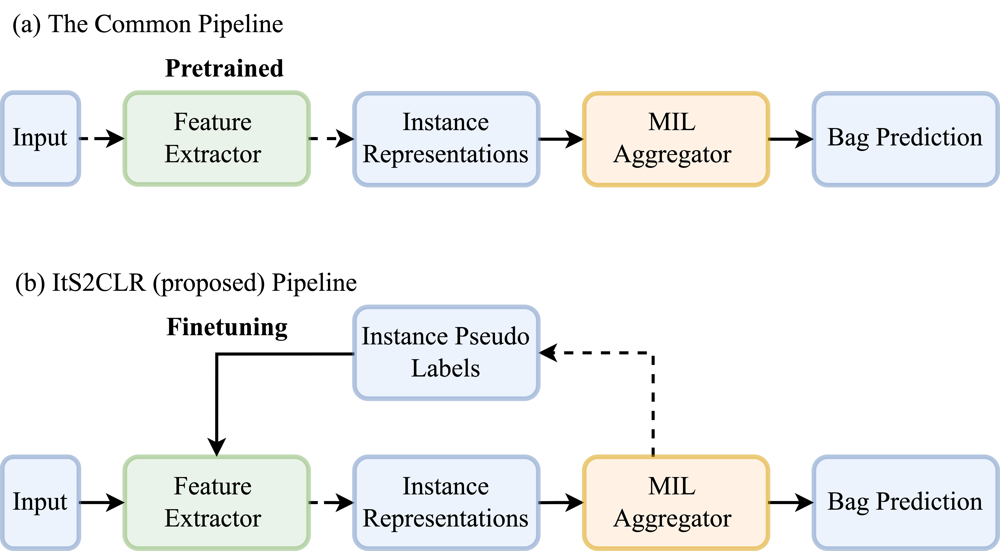

# Multiple Instance Learning via Iterative Self-Paced Supervised Contrastive Learning

[](https://cvpr2023.thecvf.com/)
[](https://arxiv.org/abs/2210.09452)
[](https://opensource.org/licenses/MIT)

This repository contains the official implementation of the CVPR 2023 paper "Multiple Instance Learning via Iterative Self-Paced Supervised Contrastive Learning"

<p align="center">
  
</p>

## Introduction

<p align="center">
   
</p>
In this paper, we propose a novel approach for Multiple Instance Learning (MIL) called Iterative Self-Paced Supervised Contrastive Learning (It2SCLR). Our approach focuses on learning high-quality instance-level representations by iteratively refining instance labels using a self-paced supervised contrastive learning framework.

Key features of our method:
- Self-paced learning to handle label noise and uncertainty.
- Supervised contrastive learning to learn discriminative instance-level embeddings.
- Iterative refinement of instance labels for robust and accurate classification.

## Dependencies
- Python 3.8+
- PyTorch 1.9.0
- torchvision 0.10.0
- numpy 1.21.0
- tqdm 4.61.2
- scikit-learn 0.24.2

You can install the required packages using the following command:

Install [anaconda/miniconda](https://docs.conda.io/en/latest/miniconda.html)  

```
  $ conda env create --name its2clr --file env.yml
  $ conda activate its2clr
```


## Dataset

### Camelyon16 dataset
For data acquisition and preprocessing, please visit [this link](https://github.com/binli123/dsmil-wsi). It is important to note that, unlike the multi-scale setting in DS-MIL, we solely employ the 5x resolution for training and evaluation.


### Training and Evaluation
To train the IT2SCLR model on your dataset, use the following command:


```bash
python run.py  \
--expname EXP_NAME \
--threshold 0.3 \
--gputype 1 \
--augment_transform 0 \
--batch_size 512 \
--pretrain_weight /checkpoints/ssl/simclr/checkpoint.pth.tar \ #SSL pretrain weight path
--pseudo_label_path /checkpoints/ssl/simclr/checkpoint/ins_pseudo_label_train.p \ #Initial pseudo label path, from the MIL trained on feature extractor using SSL pretrain weight
--MIL_every_n_epochs 5 \
--epoch_to_extract_mil 199 \
--posi_batch_ratio 0.2 \
--ro 0.2 \
--ro_neg 0.2 \
--rT 0.8 \
--warmup 15 \
--init_MIL_training yes \
--root_dir xxxx \ # /single
--labelroot xxxx \ # /single
--comet_api_key xxxxx \
```


## Citation

If you find this work beneficial, please cite our paper:

```
@article{liu2022multiple,
  title={Multiple Instance Learning via Iterative Self-Paced Supervised Contrastive Learning},
  author={Liu, Kangning and Zhu, Weicheng and Shen, Yiqiu and Liu, Sheng and Razavian, Narges and Geras, Krzysztof J and Fernandez-Granda, Carlos},
  journal={CVPR},
  year={2023}
}
```